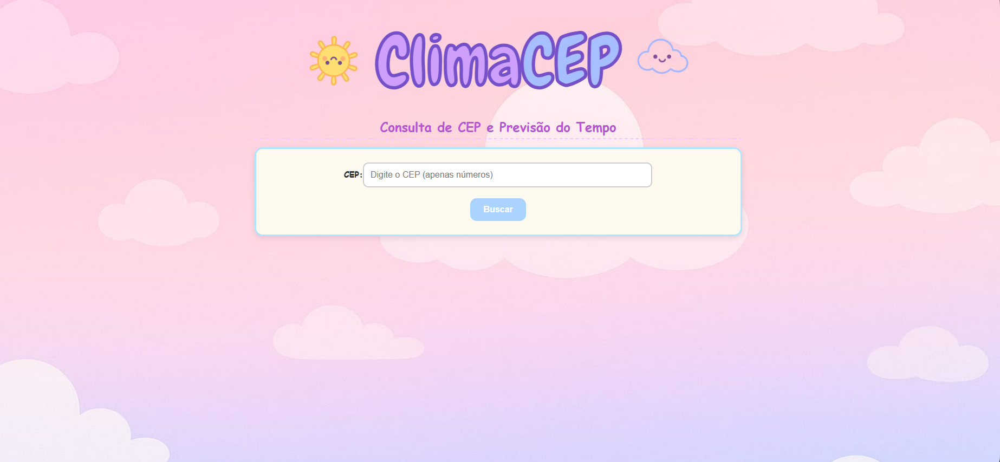
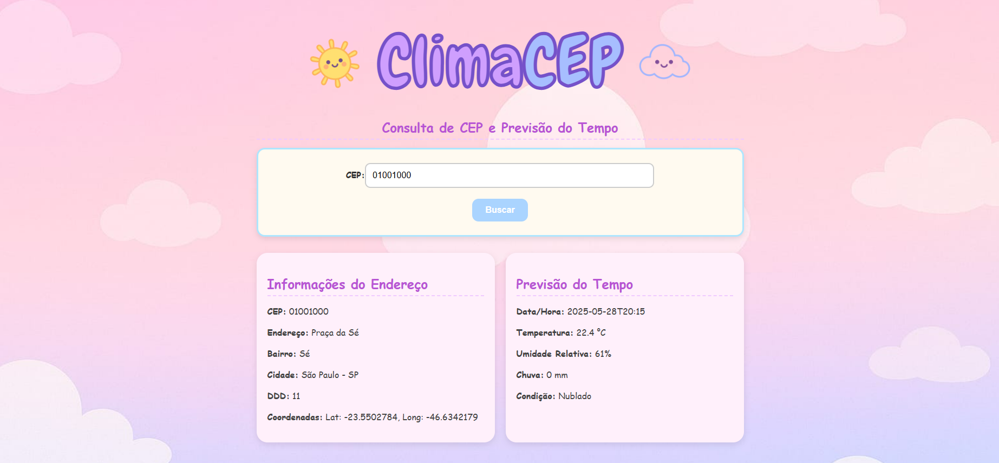

# 🌦️ ClimaCEP

ClimaCEP é uma aplicação web simples que permite consultar a previsão do tempo de uma localidade a partir do CEP informado pelo usuário. A aplicação usa a API da **AwesomeAPI** para buscar o endereço e a API **Open-Meteo** para obter os dados meteorológicos, exibindo informações atualizadas com um design fofo e ilustrativo.

---

## 🌟 Funcionalidades

- Busca dados do endereço completo a partir do CEP.
- 🌡️ Exibe a previsão do tempo atual com:
  - Temperatura
  - Umidade
  - Velocidade do vento
  - Condição do tempo (ensolarado, nublado etc.)
- Atualização em tempo real com base nas coordenadas do CEP.

---

## 💫 Tecnologias Utilizadas

- ⚛️ **React.js** – Biblioteca para construção da interface
- ⚡ **Vite** – Ferramenta de build rápida e moderna
- 🎨 **CSS3** – Estilização com tema personalizado e visual ilustrativo
- 🌐 **APIs Externas**:
  - [AwesomeAPI - CEP](https://docs.awesomeapi.com.br/api-cep) – para obter endereço a partir do CEP
  - [Open-Meteo](https://open-meteo.com/) – para obter dados climáticos com base na latitude e longitude

---

## 📸 Interface da Aplicação

<div align="center">
  
  
</div>

---

## 🪄 Como Usar

1. Clone ou baixe o repositório:  
   ```bash
   git clone https://github.com/seu-usuario/climacep.git

2. Abra o arquivo index.html em seu navegador.
3. Insita um CEP válido no campo de busca.
4. Clique em "Buscar" e veja o endereço e previsão do tempo aparecerem na tela.

---

## 📝 Exemplos de Teste

- CEP válido: 01001-000 (São Paulo - SP)
- CEP válido: 20040-010 (Rio de Janeiro - RJ)

---

## 🌸 Sobre o Projeto
Este projeto foi desenvolvido como atividade prática da disciplina de Desenvolvimento Web. Seu objetivo é integrar diferentes fontes de dados externas via API, praticar consumo de endpoints REST e criar uma interface interativa e responsiva usando React e Vite. O visual do projeto foi inspirado em temas leves e lúdicos, com o uso de imagens e ícones para tornar a experiência do usuário mais envolvente.

